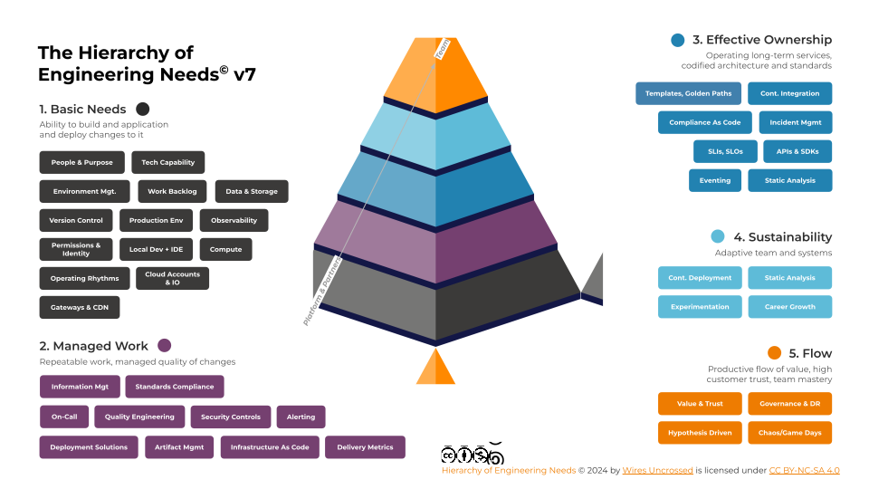
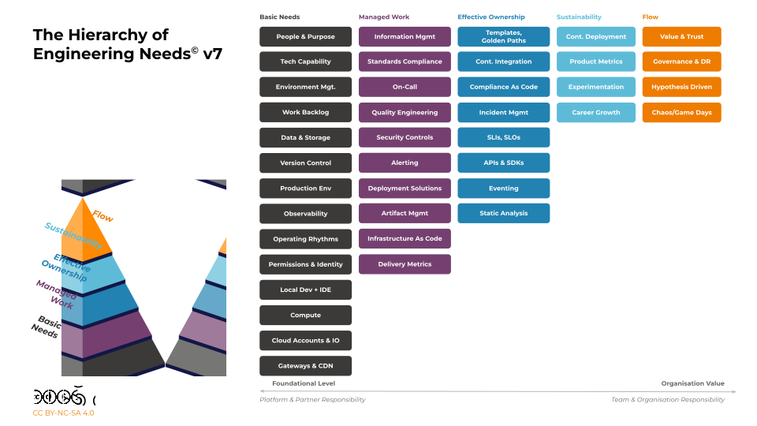
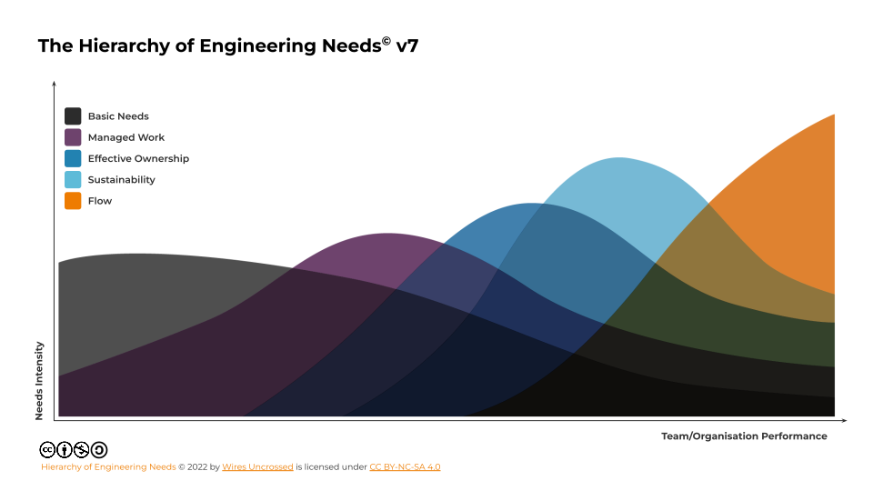

---
# To modify the layout, see
# https://jekyllrb.com/docs/themes/overriding-theme-defaults

layout: home
---

Based on years of working towards and achieving continuous delivery (routine 1+ daily production deploys) with hundreds of teams and thousands of Engineers worldwide, we have created a living model to help organisations assess and understand what constraints are the best problems to solve across architecture, cloud-native, development, operations, engineering culture, operating models, governance and team experience.

​

The Hierarchy of Engineering Needs model combines Maslow's hierarchy of needs theory with industry research and our combined lived experience to galvanise action.
​

